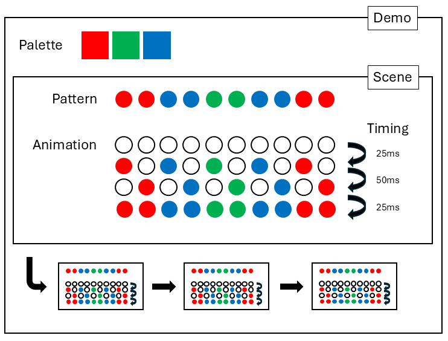

# Concepts

The objective is to offer composable objects which can be configured and combined to achieve a number of different effects.



### Palette

The colours which are to be used as part of the pattern.

### Pattern

The way in which Palette colours are applied across the LED strip.

A pattern may not change the state of the lighting strip.

A pattern may change from step to step, a scene should ensure it called the ```NextState```.

### Animation

An animation is the way in which the pattern is applied to the LED strip.

An animation may ignore the pattern for the purposes of filling colour and may also ignore the exact indexes the pattern provides as part of its animation (e.g. sliding animation).

The animation is responsible for calling ```Update``` on the lighting controller, as many times as required.

### Timing

The delay in between each step of the animation.

The scene should invoke the ```Delay``` method after calling the animation ```Step```.

### Scene

A combination of a single animation, pattern and timing.

### Demo

A combination of multiple scenes and a selected palette.

